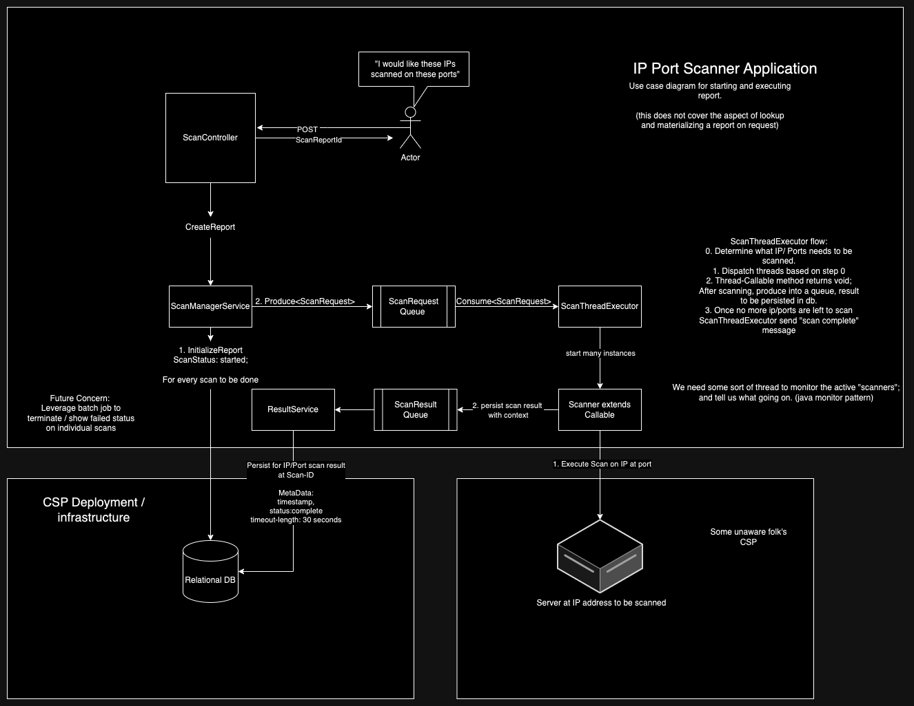

# port-scanner Java based Multi-threaded Port Scanner

## Use cases:
- Kick off port scan event at IP addresses (that you own) for specific ports and port ranges (to be scanned for each IP address). Then hit endpoint to get results.
    - User makes POST request endpoint, providing IP, List<Port> and List<PortRange> in body.
    - Application kicks off process of scanning all provided ports at IP
    - GET endpoint is available to show results and if task is complete
- Look up previously requested event, by Id
    - Response include the following:
      - Raw Scan Results
      - Original specification (what was requested initially)
      - Meter:
        - time taken

## How it works


### Port Scanning

Multi-threaded approach to execute atomic port scanning actions. 
Threads will then write to data structure containing representation of Scanning Task  


#### Set of ports to consider scanning:
```text
Port 20 (UDP) — File Transfer Protocol (FTP)
Port 22 (TCP) — Secure Shell (SSH)
Port 23 (TCP) — Telnet protocol - usually not available these days due to it being unencrypted and therefore unsecure
Port 53 (UDP) — Domain Name System (DNS)
Port 80 (TCP) — HTTP
Port 443 (TCP) — HTTPS
```

#### IPs to test against:
```text
208.67.222.222 and 208.67.220.220 (OpenDNS)
1.1.1.1 and 1.0.0.1 (Cloudflare)
8.8.8.8 and 8.8.4.4 (Google DNS)
```

## Later on ideas:
- Have separate module for actually execution of port scanning, namely, background-module
- Use module that currently defines API to produce into queue, background processing will execute port scanning and write reports to DB
- API layer will then simply read requested reports and also be able to determine if scanning task is "done".

## Self Notes:
- https://docs.spring.io/spring-data/jpa/reference/jpa/query-methods.html
- https://www.baeldung.com/spring-amqp

## Run Configurations
- Intellij Community Edition 2024
- Java Version: 17
- main class: com.ian.davidson.port.scanner.PortScannerApplication
- program args I use in addition to application.yml:
  - `spring.jpa.show-sql=true`   
  - `spring.jpa.properties.hibernate.format_sql=true`

## Required Infrastructure notes:
### Postgres:
- Instructions:
  - Run instance of postgres on localhost, default port(5432), I'm not using a password.
  - Check folder in project for "db" for initialization of schema
  - Simply execute script and you should have the entity structure expected by application
- If you are not using the same hosting of db instance you will most likely need to inject an override for the property:
  - `spring.datasource.url`
- If your instance of Postgres is uses user/password then:
  - update properties or inject overrides for `spring.datasource.username` & `spring.datasource.password` in your run config
### Rabbit MQ
- Using RabbitMQ for message queue needs
  - running instance locally using docker;
    - Start up command: `docker run -d -p 5672:5672 -p 15672:15672 --name rabbit-mq -e RABBITMQ_DEFAULT_USER=user -e RABBITMQ_DEFAULT_PASS=password rabbitmq:3-management`
      - named: "rabbit-mq"
      - username: user
      - password: password
    - Shut it down: `docker kill rabbit-mq` or name you used for container
  - Check status at exposed management port for rabbit: `http://localhost:15672/`
  - RabbitMQ docker image documentation: https://hub.docker.com/_/rabbitmq 
  - Required application properties:
    - `spring.rabbitmq.username=user`
    - `spring.rabbitmq.password=password`


## Goals:
- Replace SingleThreadScanner with Multithreaded scanner 
  - Short term goal: Multithreaded scanning (queue is still blocking) !!COMPLETE!!
    - Multithreaded scanner should have access to a dedicated ThreadPool (preferably managed by spring)
      - Properties related to size of thread pool, etc. should be configured via application.yaml
    - Implies that I'll need a class that extends callable (probably), so I can invoke for all actions that make up a scan. 
  - Longer term goal: dedicated thread pool for scanning, support concurrent processing instances of scans
    - Support multiple concurrent session processing (concurrent consumption/processing )
    - Process-wise:
      - Use Round-Robin scheduling strategy:
        - e.g. if there is 3 concurrent sessions {a,b,c}, all started at the same time, and only 1 thread in pool allocated
          - We expect to see them processed as such: `a[0] then, b[0] then, c[0] then, a[1] then b[1], etc.`
        - This ensures fair treatment across the currently active sessions.
    - Tracking:
      - keep track of all active scans ConcurrentMap<SessionId, ScanItinerary{sessionId, List<Port>, List<Address>>
        - Do transform from ScanItinerary -> (ThreadSafe impl)List<ScanOperation>; so we have the exhaustive list of work to do for given session.
      - keep track of progress on active scans with Map<SessionId, AtomicLong>
        - This will keep track of what index we are at for a given scan session
        - can consider also having another concurrent map that can act as the <SessionId, SizeOfScanOperations> so we have a thread safe way to know when a session is complete
      - Represent an atomic scan operation: (ScanOperation) { sessionId, port, address }
      - Represent an atomic scan result: (ScanResult) { sessionId, port, address }
- Update RabbitMQ config to support concurrent consumption. 
  - Instead of having a latch enforce synchronization on consumption, configure R-MQ to provision a thread for every consume
  - Use threadsafe Spring component to track concurrent "active" scans, implement interface "Scanner", explicitly wire in rather than single threaded impl
- Publish OCI image of application
  - Docker command (work in progress): `docker run -d -p 8080:8080 --name port-scanner port-scanner:latest`
  - helpful commands:
    - `sudo docker run -it --entrypoint /bin/bash <container_name>`
  - Determine how to allow for contineraized application reach infra at localhost:5432 (PSQL) & localhost:5672 (RabbitMQ), without having to provision virtual network space
- Deploy and run in kubernetes easily via helm ->
  - Build out support and instructions to reference application image build
  - Have written out template files to support initializing and running infrastructure 