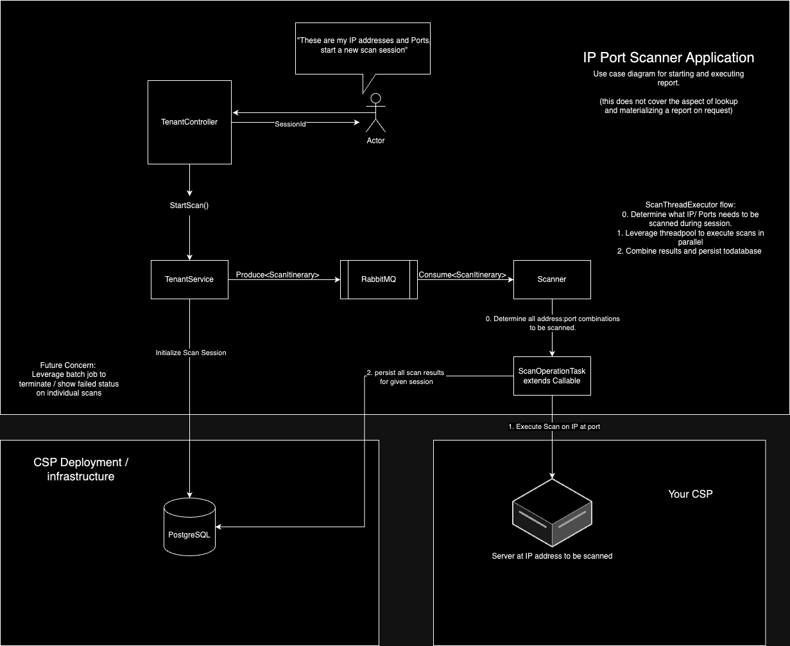

# port-scanner Java based Multi-threaded Port Scanner

## Use cases:
- Kick off port scan event at IP addresses (that you own) for specific ports and port ranges (to be scanned for each IP address). Then hit endpoint to get results.
    - User makes POST request endpoint, providing IP, List<Port> and List<PortRange> in body.
    - Application kicks off process of scanning all provided ports at IP
    - GET endpoint is available to show results and if task is complete
- Look up previously requested event, by Id
    - Response include the following:
      - Raw Scan Results
      - Original specification (what was requested initially)
      - Meter:
        - time taken

## How it works


### Port Scanning

Multi-threaded approach to execute atomic port scanning actions. 
Threads will then write to data structure containing representation of Scanning Task  


#### Set of ports to consider scanning:
```text
Port 20 (UDP) — File Transfer Protocol (FTP)
Port 22 (TCP) — Secure Shell (SSH)
Port 23 (TCP) — Telnet protocol - usually not available these days due to it being unencrypted and therefore unsecure
Port 53 (UDP) — Domain Name System (DNS)
Port 80 (TCP) — HTTP
Port 443 (TCP) — HTTPS
```

#### IPs to test against:
```text
208.67.222.222 and 208.67.220.220 (OpenDNS)
1.1.1.1 and 1.0.0.1 (Cloudflare)
8.8.8.8 and 8.8.4.4 (Google DNS)
```

## Later on ideas:
- Have separate module for actually execution of port scanning, namely, background-module
- Use module that currently defines API to produce into queue, background processing will execute port scanning and write reports to DB
- API layer will then simply read requested reports and also be able to determine if scanning task is "done".

## Self Notes:
- https://docs.spring.io/spring-data/jpa/reference/jpa/query-methods.html
- https://www.baeldung.com/spring-amqp

## Run Configurations
- Intellij Community Edition 2024
- Java Version: 17
- main class: com.ian.davidson.port.scanner.PortScannerApplication
- program args I use in addition to application.yml:
  - `--spring.jpa.show-sql=true`
  - `--spring.jpa.properties.hibernate.format_sql=true`
  - `--spring.profiles.active=dev`

### Swagger link
- http://localhost:8080/scanner/swagger-ui/index.html#

## Required Infrastructure notes:
### Postgres:
- Instructions:
  - Run instance of postgres on localhost, default port(5432), I'm not using a password.
  - Check folder in project for "db" for initialization of schema
  - Simply execute script and you should have the entity structure expected by application
- If you are not using the same hosting of db instance you will most likely need to inject an override for the property:
  - `spring.datasource.url`
- If your instance of Postgres is uses user/password then:
  - update properties or inject overrides for `spring.datasource.username` & `spring.datasource.password` in your run config
### Rabbit MQ
- Using RabbitMQ for message queue needs
  - running instance locally using docker;
    - Start up command: `docker run -d -p 5672:5672 -p 15672:15672 --name rabbit-mq -e RABBITMQ_DEFAULT_USER=user -e RABBITMQ_DEFAULT_PASS=password rabbitmq:3-management`
      - named: "rabbit-mq"
      - username: user
      - password: password
    - Shut it down: `docker rm rabbitmq` or name you used for container
    - Remove 
  - Check status at exposed management port for rabbit: `http://localhost:15672/`
  - RabbitMQ docker image documentation: https://hub.docker.com/_/rabbitmq 
  - Required application properties:
    - `spring.rabbitmq.username=user`
    - `spring.rabbitmq.password=password`

### Running application in containerized environment
- Publish OCI image of application using google jib gradle plugin:
  - gradle command: `./gradlew clean build jibDockerBuild`
- Start up application via docker
  - Start command: `docker run -d --name port-scanner -p 8080:8080 -p 9080:9080 port-scanner:latest`
  - Shut it down: `docker rm port-scanner` 
  - helpful commands:
    - `sudo docker run -it --entrypoint sh <container_name>`

## Goals:
- Deploy and run in kubernetes easily via helm ->
  - Build out support and instructions to reference application image build
  - Have written out template files to support initializing and running infrastructure 
  - Fully initialize postgres schema using db/init.sql in repo